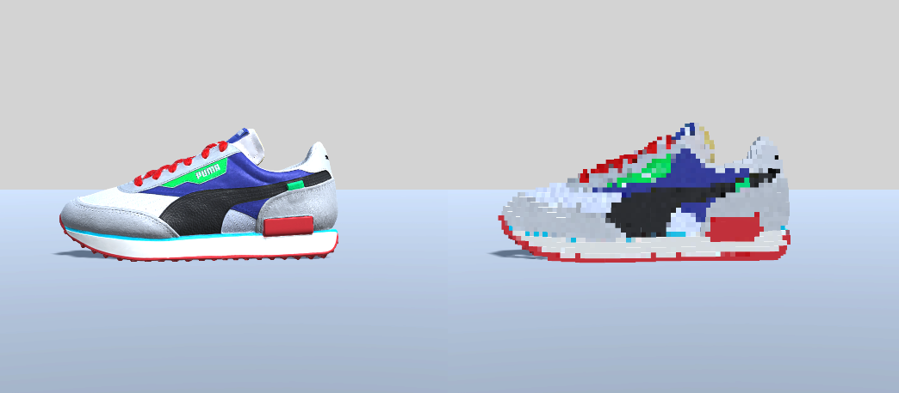

# Model2VoxelConverter
The Model2VoxelConverter is a tool designed to transform a single mesh model into a voxel model within the Unity environment. 

**Setup:**
1. Import the `Model2Voxel` folder into your Unity project.
2. Attach the `Voxel` class to a GameObject.

Refer to the base setup example provided in the Voxel scene, where a GameObject is already attached to the `Voxel` class component.
Run the project and click the `Generate` button to view the result.

**Features:**
- Converts a Voxel model into a single GameObject with a MeshRenderer.
- Currently supports export to .ply format only.
- Adjustable Voxel grid size.
 Note that the generation time varies based on the grid size; extensive testing has been conducted with grid sizes ranging from 8 to 60. 

Example usage: `_voxel.GenerateVoxel(8 to 60, _targetObj);`

**Not Implemented:**
- The target model's world and local positions/rotations must be set to `0,0,0`. This feature does not currently adjust based on the target object's transform.
- The Model with the SkinnedMeshRenderer and bone animation
- Multiple MeshRenderers

**Partially Implemented:**
- FBX import feature

**UnityFBXLoader:**
The UnityFBXLoader is an adaptation of the Three-Fbx-Loader, focusing on extracting geometry data to generate the mesh.  
Note: This class is experimental and not recommended for production use. However, it serves as a useful starting point for further development based on the Three-Fbx-Loader.

Reference: [Three-Fbx-Loader](https://www.npmjs.com/package/three-fbx-loader?activeTab=code)

**Unity Editor Compatibility:**
Version 2023.2.4f1 and above.

**Tested Platforms:**
- Android OS9
- Unity Editor

Further device testing will be conducted in the future.

**3D models:**
 The model was provided for the AR contest invented by the Highsnobiety in 2019.

https://www.highsnobiety.com
